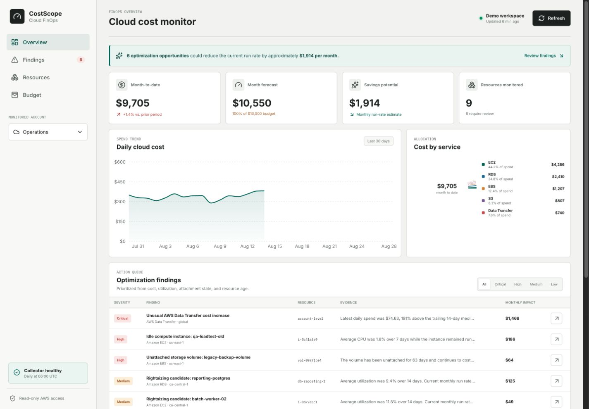

# CostScope: Cloud Cost and Resource Monitor

CostScope is a read-only FinOps application that turns AWS billing and utilization data into a prioritized action queue. It tracks historical spend, forecasts the current month, inventories resources, detects waste, estimates monthly impact, and explains the evidence behind every finding.

The repository includes a safe public demo with generated data and a live AWS mode for an authorized account.



## What it detects

- Idle EC2 instances using seven-day CPU utilization
- Rightsizing candidates using utilization and monthly run rate
- Unattached EBS volumes and stale snapshots
- Service-level daily cost spikes against a trailing median
- Forecasted budget pressure
- Missing ownership context through resource tags

The monitor never stops, resizes, or deletes resources. Findings are recommendations that require owner review and an approved infrastructure change.

## Technology

- React, TypeScript, Recharts, and Lucide for the dashboard
- FastAPI and Pydantic for the API contract
- AWS Cost Explorer, CloudWatch, EC2, EBS, RDS, EventBridge, ECS Fargate, SNS, and Secrets Manager
- SQLite for local demo mode and PostgreSQL for live infrastructure
- Docker Compose for local operation
- Terraform for IAM, networking, PostgreSQL, scheduling, and alerting
- pytest, TypeScript checks, and GitHub Actions for CI

## Run the public demo locally

```bash
python3 -m venv .venv
.venv/bin/pip install -r backend/requirements.txt
.venv/bin/python scripts_export_demo.py
cd frontend
npm install
npm run dev
```

Open `http://localhost:5173`.

## Run the connected application

Start the API:

```bash
cp .env.example .env
cd backend
../.venv/bin/uvicorn app.main:app --reload --port 8000
```

Start the dashboard with `VITE_API_URL=http://localhost:8000`. For AWS collection, set `APP_MODE=aws` and use an AWS profile or task role with the read-only permissions in `infra/main.tf`.

## Docker

```bash
docker compose up --build
```

The dashboard runs on `http://localhost:5173` and the API documentation is available at `http://localhost:8000/docs`.

## Infrastructure

The Terraform configuration creates a private PostgreSQL instance, a daily ECS Fargate collector, least-privilege IAM roles, an EventBridge schedule, SNS alerts, Secrets Manager storage, and CloudWatch log retention.

Review the expected AWS charges before applying the live stack. The public demo does not require cloud infrastructure.

```bash
cd infra
cp terraform.tfvars.example terraform.tfvars
terraform init
terraform plan
terraform apply
```

## Tests

```bash
cd backend
../.venv/bin/pytest -q

cd ../frontend
npm run lint
npm run build
```

The tests verify threshold behavior, false-positive suppression, cost-spike baselines, dashboard consistency, and API availability.

See [architecture](docs/ARCHITECTURE.md) and the [operating runbook](docs/RUNBOOK.md) for implementation and response details.
